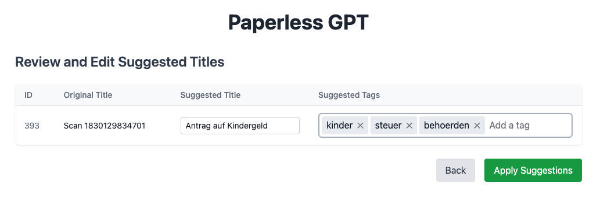
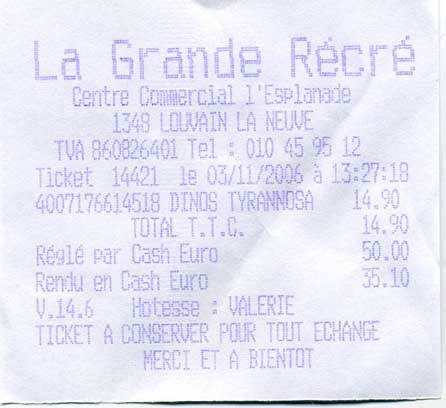
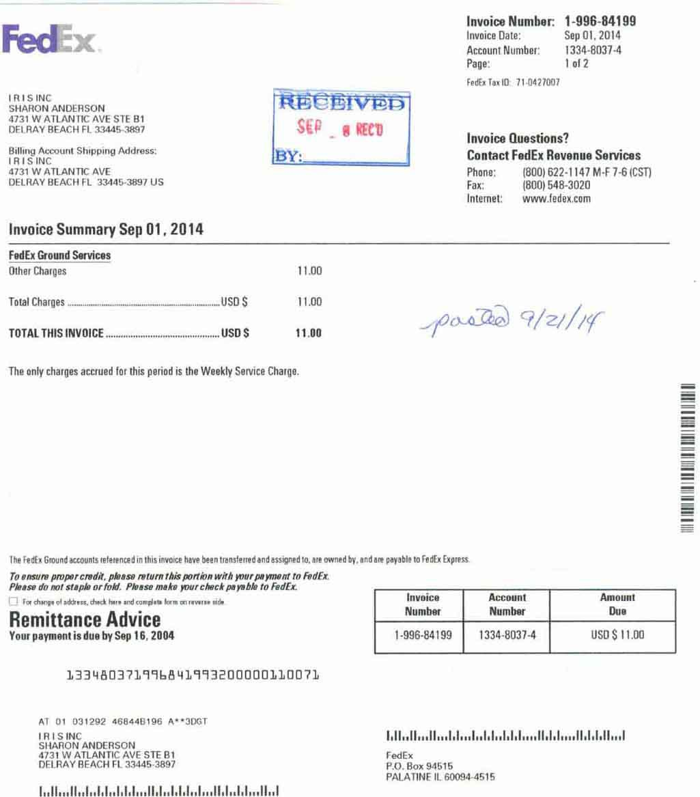

# paperless-gpt
[](LICENSE)
[](https://discord.gg/fJQppDH2J7)
[](https://hub.docker.com/r/icereed/paperless-gpt)
[](CODE_OF_CONDUCT.md)



**paperless-gpt** seamlessly pairs with [paperless-ngx][paperless-ngx] to generate **AI-powered document titles** and **tags**, saving you hours of manual sorting. While other tools may offer AI chat features, **paperless-gpt** stands out by **supercharging OCR with LLMs**—ensuring high accuracy, even with tricky scans. If you’re craving next-level text extraction and effortless document organization, this is your solution.

https://github.com/user-attachments/assets/bd5d38b9-9309-40b9-93ca-918dfa4f3fd4

---

## Key Highlights

1. **LLM-Enhanced OCR**  
   Harness Large Language Models (OpenAI or Ollama) for **better-than-traditional** OCR—turn messy or low-quality scans into context-aware, high-fidelity text.

2. **Automatic Title & Tag Generation**  
   No more guesswork. Let the AI do the naming and categorizing. You can easily review suggestions and refine them if needed.

3. **Supports DeepSeek reasoning models in Ollama**  
   Greatly enhance accuracy by using a reasoning model like `deepseek-r1:8b`. The perfect tradeoff between privacy and performance! Of course, if you got enough GPUs or NPUs, a bigger model will enhance the experience.
   
5. **Automatic Correspondent Generation**  
   Automatically identify and generate correspondents from your documents, making it easier to track and organize your communications.

6. **Extensive Customization**  
   - **Prompt Templates**: Tweak your AI prompts to reflect your domain, style, or preference.  
   - **Tagging**: Decide how documents get tagged—manually, automatically, or via OCR-based flows.

7. **Simple Docker Deployment**  
   A few environment variables, and you’re off! Compose it alongside paperless-ngx with minimal fuss.

8. **Unified Web UI**  
   - **Manual Review**: Approve or tweak AI’s suggestions.  
   - **Auto Processing**: Focus only on edge cases while the rest is sorted for you.

9. **Opt-In LLM-based OCR**  
   If you opt in, your images get read by a Vision LLM, pushing boundaries beyond standard OCR tools.

---

## Table of Contents
- [Key Highlights](#key-highlights)
- [Getting Started](#getting-started)
  - [Prerequisites](#prerequisites)
  - [Installation](#installation)
    - [Docker Compose](#docker-compose)
    - [Manual Setup](#manual-setup)
- [Configuration](#configuration)
  - [Environment Variables](#environment-variables)
  - [Custom Prompt Templates](#custom-prompt-templates)
    - [Prompt Templates Directory](#prompt-templates-directory)
    - [Mounting the Prompts Directory](#mounting-the-prompts-directory)
    - [Editing the Prompt Templates](#editing-the-prompt-templates)
    - [Template Syntax and Variables](#template-syntax-and-variables)
- [OCR using AI](#llm-based-ocr-compare-for-yourself)
- [Usage](#usage)
- [Contributing](#contributing)
- [License](#license)
- [Star History](#star-history)
- [Disclaimer](#disclaimer)

---

## Getting Started

### Prerequisites
- [Docker][docker-install] installed.
- A running instance of [paperless-ngx][paperless-ngx].
- Access to an LLM provider:
  - **OpenAI**: An API key with models like `gpt-4o` or `gpt-3.5-turbo`.
  - **Ollama**: A running Ollama server with models like `deepseek-r1:8b`.

### Installation

#### Docker Compose

Here’s an example `docker-compose.yml` to spin up **paperless-gpt** alongside paperless-ngx:

```yaml
version: "3.7"
services:
  paperless-ngx:
    image: ghcr.io/paperless-ngx/paperless-ngx:latest
    # ... (your existing paperless-ngx config)

  paperless-gpt:
    image: icereed/paperless-gpt:latest
    environment:
      PAPERLESS_BASE_URL: 'http://paperless-ngx:8000'
      PAPERLESS_API_TOKEN: 'your_paperless_api_token'
      PAPERLESS_PUBLIC_URL: 'http://paperless.mydomain.com' # Optional
      MANUAL_TAG: 'paperless-gpt'          # Optional, default: paperless-gpt
      AUTO_TAG: 'paperless-gpt-auto'       # Optional, default: paperless-gpt-auto
      LLM_PROVIDER: 'openai'               # or 'ollama'
      LLM_MODEL: 'gpt-4o'                  # or 'deepseek-r1:8b'
      # Optional, but recommended for Ollama
      TOKEN_LIMIT: 1000
      OPENAI_API_KEY: 'your_openai_api_key'
      # Optional - OPENAI_BASE_URL: 'https://litellm.yourinstallationof.it.com/v1'
      LLM_LANGUAGE: 'English'              # Optional, default: English
      OLLAMA_HOST: 'http://host.docker.internal:11434' # If using Ollama
      VISION_LLM_PROVIDER: 'ollama'        # (for OCR) - openai or ollama
      VISION_LLM_MODEL: 'minicpm-v'        # (for OCR) - minicpm-v (ollama example), gpt-4o (for openai), etc.
      AUTO_OCR_TAG: 'paperless-gpt-ocr-auto' # Optional, default: paperless-gpt-ocr-auto
      OCR_LIMIT_PAGES: '5'                 # Optional, default: 5. Set to 0 for no limit.
      LOG_LEVEL: 'info'                    # Optional: debug, warn, error
    volumes:
      - ./prompts:/app/prompts   # Mount the prompts directory
    ports:
      - "8080:8080"
    depends_on:
      - paperless-ngx
```

**Pro Tip**: Replace placeholders with real values and read the logs if something looks off.

#### Manual Setup
1. **Clone the Repository**  
   ```bash
   git clone https://github.com/icereed/paperless-gpt.git
   cd paperless-gpt
   ```
2. **Create a `prompts` Directory**  
   ```bash
   mkdir prompts
   ```
3. **Build the Docker Image**  
   ```bash
   docker build -t paperless-gpt .
   ```
4. **Run the Container**  
   ```bash
   docker run -d \
     -e PAPERLESS_BASE_URL='http://your_paperless_ngx_url' \
     -e PAPERLESS_API_TOKEN='your_paperless_api_token' \
     -e LLM_PROVIDER='openai' \
     -e LLM_MODEL='gpt-4o' \
     -e OPENAI_API_KEY='your_openai_api_key' \
     -e LLM_LANGUAGE='English' \
     -e VISION_LLM_PROVIDER='ollama' \
     -e VISION_LLM_MODEL='minicpm-v' \
     -e LOG_LEVEL='info' \
     -v $(pwd)/prompts:/app/prompts \
     -p 8080:8080 \
     paperless-gpt
   ```

---

## Configuration

### Environment Variables

**Note:** When using Ollama, ensure that the Ollama server is running and accessible from the paperless-gpt container.
=======
| Variable               | Description                                                                                                      | Required |
|------------------------|------------------------------------------------------------------------------------------------------------------|----------|
| `PAPERLESS_BASE_URL`   | URL of your paperless-ngx instance (e.g. `http://paperless-ngx:8000`).                                          | Yes      |
| `PAPERLESS_API_TOKEN`  | API token for paperless-ngx. Generate one in paperless-ngx admin.                                               | Yes      |
| `PAPERLESS_PUBLIC_URL` | Public URL for Paperless (if different from `PAPERLESS_BASE_URL`).                                              | No       |
| `MANUAL_TAG`           | Tag for manual processing. Default: `paperless-gpt`.                                                            | No       |
| `AUTO_TAG`             | Tag for auto processing. Default: `paperless-gpt-auto`.                                                         | No       |
| `LLM_PROVIDER`         | AI backend (`openai` or `ollama`).                                                                              | Yes      |
| `LLM_MODEL`            | AI model name, e.g. `gpt-4o`, `gpt-3.5-turbo`, `deepseek-r1:8b`.                                                | Yes      |
| `OPENAI_API_KEY`       | OpenAI API key (required if using OpenAI).                                                                      | Cond.    |
| `OPENAI_BASE_URL`      | OpenAI base URL (optional, if using a custom OpenAI compatible service like LiteLLM).                                              | No       |
| `LLM_LANGUAGE`         | Likely language for documents (e.g. `English`). Default: `English`.                                             | No       |
| `OLLAMA_HOST`          | Ollama server URL (e.g. `http://host.docker.internal:11434`).                                                   | No       |
| `VISION_LLM_PROVIDER`  | AI backend for OCR (`openai` or `ollama`).                                                                      | No       |
| `VISION_LLM_MODEL`     | Model name for OCR (e.g. `minicpm-v`).                                                                          | No       |
| `AUTO_OCR_TAG`         | Tag for automatically processing docs with OCR. Default: `paperless-gpt-ocr-auto`.                              | No       |
| `LOG_LEVEL`            | Application log level (`info`, `debug`, `warn`, `error`). Default: `info`.                                      | No       |
| `LISTEN_INTERFACE`     | Network interface to listen on. Default: `:8080`.                                                               | No       |
| `AUTO_GENERATE_TITLE`  | Generate titles automatically if `paperless-gpt-auto` is used. Default: `true`.                                  | No       |
| `AUTO_GENERATE_TAGS`   | Generate tags automatically if `paperless-gpt-auto` is used. Default: `true`.                                   | No       |
| `AUTO_GENERATE_CORRESPONDENTS` | Generate correspondents automatically if `paperless-gpt-auto` is used. Default: `true`.                   | No       |
| `OCR_LIMIT_PAGES`      | Limit the number of pages for OCR. Set to `0` for no limit. Default: `5`.                                       | No       |
| `TOKEN_LIMIT`          | Maximum tokens allowed for prompts/content. Set to `0` to disable limit. Useful for smaller LLMs.                | No       |
| `CORRESPONDENT_BLACK_LIST` | A comma-separated list of names to exclude from the correspondents suggestions. Example: `John Doe, Jane Smith`.  

### Custom Prompt Templates

paperless-gpt’s flexible **prompt templates** let you shape how AI responds:

1. **`title_prompt.tmpl`**: For document titles.  
2. **`tag_prompt.tmpl`**: For tagging logic.
3. **`ocr_prompt.tmpl`**: For LLM OCR.
4. **`correspondent_prompt.tmpl`**: For correspondent identification.

Mount them into your container via:

```yaml
  volumes:
    - ./prompts:/app/prompts
```

Then tweak at will—**paperless-gpt** reloads them automatically on startup!

#### Template Variables

Each template has access to specific variables:

**title_prompt.tmpl**:
- `{{.Language}}` - Target language (e.g., "English")
- `{{.Content}}` - Document content text
- `{{.Title}}` - Original document title

**tag_prompt.tmpl**:
- `{{.Language}}` - Target language
- `{{.AvailableTags}}` - List of existing tags in paperless-ngx
- `{{.OriginalTags}}` - Document's current tags
- `{{.Title}}` - Document title
- `{{.Content}}` - Document content text

**ocr_prompt.tmpl**:
- `{{.Language}}` - Target language

**correspondent_prompt.tmpl**:
- `{{.Language}}` - Target language
- `{{.AvailableCorrespondents}}` - List of existing correspondents
- `{{.BlackList}}` - List of blacklisted correspondent names
- `{{.Title}}` - Document title
- `{{.Content}}` - Document content text

The templates use Go's text/template syntax. paperless-gpt automatically reloads template changes on startup.

---

## Usage

1. **Tag Documents**  
   - Add `paperless-gpt` or your custom tag to the docs you want to AI-ify.

2. **Visit Web UI**  
   - Go to `http://localhost:8080` (or your host) in your browser.

3. **Generate & Apply Suggestions**  
   - Click “Generate Suggestions” to see AI-proposed titles/tags/correspondents.
   - Approve, edit, or discard. Hit “Apply” to finalize in paperless-ngx.

4. **Try LLM-Based OCR (Experimental)**  
   - If you enabled `VISION_LLM_PROVIDER` and `VISION_LLM_MODEL`, let AI-based OCR read your scanned PDFs.  
   - Tag those documents with `paperless-gpt-ocr-auto` (or your custom `AUTO_OCR_TAG`).

**Tip**: The entire pipeline can be **fully automated** if you prefer minimal manual intervention.

---

## LLM-Based OCR: Compare for Yourself

<details>
<summary>Click to expand the vanilla OCR vs. AI-powered OCR comparison</summary>

### Example 1

**Image**:



**Vanilla Paperless-ngx OCR**:
```
La Grande Recre

Gentre Gommercial 1'Esplanade
1349 LOLNAIN LA NEWWE
TA BERBOGAAL Tel =. 010 45,96 12
Ticket 1440112 03/11/2006 a 13597:
4007176614518. DINOS. TYRAMNESA
TOTAET.T.LES
ReslE par Lask-Euron
Rencu en Cash Euro
V.14.6 -Hotgese = VALERTE
TICKET A-GONGERVER PORR TONT. EEHANGE
HERET ET A BIENTOT
```

**LLM-Powered OCR (OpenAI gpt-4o)**:
```
La Grande Récré
Centre Commercial l'Esplanade
1348 LOUVAIN LA NEUVE
TVA 860826401 Tel : 010 45 95 12
Ticket 14421 le 03/11/2006 à 15:27:18
4007176614518 DINOS TYRANNOSA 14.90
TOTAL T.T.C. 14.90
Réglé par Cash Euro 50.00
Rendu en Cash Euro 35.10
V.14.6 Hôtesse : VALERIE
TICKET A CONSERVER POUR TOUT ECHANGE
MERCI ET A BIENTOT
```

---

### Example 2

**Image**:



**Vanilla Paperless-ngx OCR**:
```
Invoice Number: 1-996-84199

Fed: Invoica Date: Sep01, 2014
Accaunt Number: 1334-8037-4
Page: 1012

Fod£x Tax ID 71.0427007

IRISINC
SHARON ANDERSON
4731 W ATLANTIC AVE STE BI
DELRAY BEACH FL 33445-3897 ’ a
Invoice Questions?

Bing, ‚Account Shipping Address: Contact FedEx Reı

ISINC
4731 W ATLANTIC AVE Phone: (800) 622-1147 M-F 7-6 (CST)
DELRAY BEACH FL 33445-3897 US Fax: (800) 548-3020

Internet: www.fedex.com

Invoice Summary Sep 01, 2014

FodEx Ground Services
Other Charges 11.00
Total Charges 11.00 Da £
>
polo) Fz// /G
TOTAL THIS INVOICE .... usps 11.00 P 2/1 f

‘The only charges accrued for this period is the Weekly Service Charge.

The Fedix Ground aceounts teferencedin his involce have been transteired and assigned 10, are owned by,andare payable to FedEx Express:

To onsurs propor credit, plasa raturn this portion wirh your payment 10 FodEx
‚Please do not staple or fold. Ploase make your chack payablı to FedEx.

[TI For change ol address, hc har and camphat lrm or never ide

Remittance Advice
Your payment is due by Sep 16, 2004

Number Number Dus

1334803719968 41993200000110071

AT 01 0391292 468448196 A**aDGT

IRISINC Illallun elalalssollallansdHilalellund
SHARON ANDERSON

4731 W ATLANTIC AVE STEBI FedEx

DELRAY BEACH FL 334453897 PO. Box 94516

PALATINE IL 60094-4515
```

**LLM-Powered OCR (OpenAI gpt-4o)**:
```
FedEx.                                                                                      Invoice Number: 1-996-84199
                                                                                           Invoice Date: Sep 01, 2014
                                                                                           Account Number: 1334-8037-4
                                                                                           Page: 1 of 2
                                                                                           FedEx Tax ID: 71-0427007

I R I S INC
SHARON ANDERSON
4731 W ATLANTIC AVE STE B1
DELRAY BEACH FL 33445-3897
                                                                                           Invoice Questions?
Billing Account Shipping Address:                                                          Contact FedEx Revenue Services
I R I S INC                                                                                Phone: (800) 622-1147 M-F 7-6 (CST)
4731 W ATLANTIC AVE                                                                        Fax: (800) 548-3020
DELRAY BEACH FL 33445-3897 US                                                              Internet: www.fedex.com

Invoice Summary Sep 01, 2014

FedEx Ground Services
Other Charges                                                                 11.00

Total Charges .......................................................... USD $          11.00

TOTAL THIS INVOICE .............................................. USD $                 11.00

The only charges accrued for this period is the Weekly Service Charge.

                                                                                           RECEIVED
                                                                                           SEP _ 8 REC'D
                                                                                           BY: _

                                                                                           posted 9/21/14

The FedEx Ground accounts referenced in this invoice have been transferred and assigned to, are owned by, and are payable to FedEx Express.

To ensure proper credit, please return this portion with your payment to FedEx.
Please do not staple or fold. Please make your check payable to FedEx.

❑ For change of address, check here and complete form on reverse side.

Remittance Advice
Your payment is due by Sep 16, 2004

Invoice
Number
1-996-84199

Account
Number
1334-8037-4

Amount
Due
USD $ 11.00

133480371996841993200000110071

AT 01 031292 468448196 A**3DGT

I R I S INC
SHARON ANDERSON
4731 W ATLANTIC AVE STE B1
DELRAY BEACH FL 33445-3897

FedEx
P.O. Box 94515
```

---
</details>

**Why Does It Matter?**  
- Traditional OCR often jumbles text from complex or low-quality scans.  
- Large Language Models interpret context and correct likely errors, producing results that are more precise and readable.  
- You can integrate these cleaned-up texts into your **paperless-ngx** pipeline for better tagging, searching, and archiving.


### How It Works

- **Vanilla OCR** typically uses classical methods or Tesseract-like engines to extract text, which can result in garbled outputs for complex fonts or poor-quality scans.  
- **LLM-Powered OCR** uses your chosen AI backend—OpenAI or Ollama—to interpret the image’s text in a more context-aware manner. This leads to fewer errors and more coherent text.

---

## Troubleshooting

### Working with Local LLMs

When using local LLMs (like those through Ollama), you might need to adjust certain settings to optimize performance:

#### Token Management
- Use `TOKEN_LIMIT` environment variable to control the maximum number of tokens sent to the LLM
- Smaller models might truncate content unexpectedly if given too much text
- Start with a conservative limit (e.g., 1000 tokens) and adjust based on your model's capabilities
- Set to `0` to disable the limit (use with caution)

Example configuration for smaller models:
```yaml
environment:
  TOKEN_LIMIT: '2000'  # Adjust based on your model's context window
  LLM_PROVIDER: 'ollama'
  LLM_MODEL: 'deepseek-r1:8b'  # Or other local model
```

Common issues and solutions:
- If you see truncated or incomplete responses, try lowering the `TOKEN_LIMIT`
- If processing is too limited, gradually increase the limit while monitoring performance
- For models with larger context windows, you can increase the limit or disable it entirely

## Contributing

**Pull requests** and **issues** are welcome!  
1. Fork the repo  
2. Create a branch (`feature/my-awesome-update`)  
3. Commit changes (`git commit -m "Improve X"`)  
4. Open a PR

Check out our [contributing guidelines](CONTRIBUTING.md) for details.

---

## License

paperless-gpt is licensed under the [MIT License](LICENSE). Feel free to adapt and share!

---

## Star History
[](https://star-history.com/#icereed/paperless-gpt&Date)

---

## Disclaimer
This project is **not** officially affiliated with [paperless-ngx][paperless-ngx]. Use at your own risk.

---

**paperless-gpt**: The **LLM-based** companion your doc management has been waiting for. Enjoy effortless, intelligent document titles, tags, and next-level OCR.

[paperless-ngx]: https://github.com/paperless-ngx/paperless-ngx
[docker-install]: https://docs.docker.com/get-docker/
