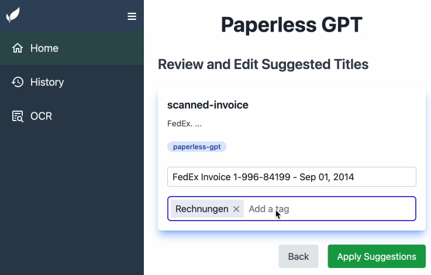

# paperless-gpt

[](LICENSE)
[](https://hub.docker.com/r/icereed/paperless-gpt)
[](code_of_conduct.md)



**paperless-gpt** is a tool designed to generate accurate and meaningful document titles and tags for [paperless-ngx](https://github.com/paperless-ngx/paperless-ngx) using Large Language Models (LLMs). It supports multiple LLM providers, including **OpenAI** and **Ollama**. With paperless-gpt, you can streamline your document management by automatically suggesting appropriate titles and tags based on the content of your scanned documents.

[](./demo.gif)

## Features

- **Multiple LLM Support**: Choose between OpenAI and Ollama for generating document titles and tags.
- **Customizable Prompts**: Modify the prompt templates to suit your specific needs.
- **Easy Integration**: Works seamlessly with your existing paperless-ngx setup.
- **User-Friendly Interface**: Intuitive web interface for reviewing and applying suggested titles and tags.
- **Dockerized Deployment**: Simple setup using Docker and Docker Compose.
- **Automatic Document Processing**: Automatically apply generated suggestions for documents with the `paperless-gpt-auto` tag.
- **Experimental OCR Feature**: Send documents to a vision LLM for OCR processing.

## Table of Contents

- [paperless-gpt](#paperless-gpt)
  - [Features](#features)
  - [Table of Contents](#table-of-contents)
  - [Getting Started](#getting-started)
    - [Prerequisites](#prerequisites)
    - [Installation](#installation)
      - [Docker Compose](#docker-compose)
      - [Manual Setup](#manual-setup)
  - [Configuration](#configuration)
    - [Environment Variables](#environment-variables)
    - [Custom Prompt Templates](#custom-prompt-templates)
      - [Prompt Templates Directory](#prompt-templates-directory)
      - [Mounting the Prompts Directory](#mounting-the-prompts-directory)
      - [Editing the Prompt Templates](#editing-the-prompt-templates)
      - [Template Syntax and Variables](#template-syntax-and-variables)
  - [Usage](#usage)
  - [Contributing](#contributing)
  - [License](#license)
  - [Star History](#star-history)

## Getting Started

### Prerequisites

- [Docker](https://www.docker.com/get-started) installed on your system.
- A running instance of [paperless-ngx](https://github.com/paperless-ngx/paperless-ngx).
- Access to an LLM provider:
  - **OpenAI**: An API key with access to models like `gpt-4o` or `gpt-3.5-turbo`.
  - **Ollama**: A running Ollama server with models like `llama2` installed.

### Installation

#### Docker Compose

The easiest way to get started is by using Docker Compose. Below is an example `docker-compose.yml` file to set up paperless-gpt alongside paperless-ngx.

```yaml
version: '3.7'
services:
  paperless-ngx:
    image: ghcr.io/paperless-ngx/paperless-ngx:latest
    # ... (your existing paperless-ngx configuration)

  paperless-gpt:
    image: icereed/paperless-gpt:latest
    environment:
      PAPERLESS_BASE_URL: 'http://paperless-ngx:8000'
      PAPERLESS_API_TOKEN: 'your_paperless_api_token'
      PAPERLESS_PUBLIC_URL: 'http://paperless.mydomain.com' # Optional, your public link to access Paperless
      LLM_PROVIDER: 'openai' # or 'ollama'
      LLM_MODEL: 'gpt-4o'     # or 'llama2'
      OPENAI_API_KEY: 'your_openai_api_key' # Required if using OpenAI
      LLM_LANGUAGE: 'English' # Optional, default is 'English'
      OLLAMA_HOST: 'http://host.docker.internal:11434' # If using Ollama
      VISION_LLM_PROVIDER: 'ollama' # Optional (for OCR) - ollama or openai
      VISION_LLM_MODEL: 'minicpm-v' # Optional (for OCR) - minicpm-v, for example for ollama, gpt-4o for openai
      LOG_LEVEL: 'info' # Optional or 'debug', 'warn', 'error'
    volumes:
      - ./prompts:/app/prompts # Mount the prompts directory
    ports:
      - '8080:8080'
    depends_on:
      - paperless-ngx
```

**Note:** Replace the placeholder values with your actual configuration.

#### Manual Setup

If you prefer to run the application manually:

1. **Clone the Repository:**

   ```bash
   git clone https://github.com/icereed/paperless-gpt.git
   cd paperless-gpt
   ```

2. **Create a `prompts` Directory:**

   ```bash
   mkdir prompts
   ```

3. **Build the Docker Image:**

   ```bash
   docker build -t paperless-gpt .
   ```

4. **Run the Container:**

   ```bash
   docker run -d \
     -e PAPERLESS_BASE_URL='http://your_paperless_ngx_url' \
     -e PAPERLESS_API_TOKEN='your_paperless_api_token' \
     -e LLM_PROVIDER='openai' \
     -e LLM_MODEL='gpt-4o' \
     -e OPENAI_API_KEY='your_openai_api_key' \
     -e LLM_LANGUAGE='English' \
     -e VISION_LLM_PROVIDER='ollama' \
     -e VISION_LLM_MODEL='minicpm-v' \
     -e LOG_LEVEL='info' \
     -v $(pwd)/prompts:/app/prompts \  # Mount the prompts directory
     -p 8080:8080 \
     paperless-gpt
   ```

## Configuration

### Environment Variables

| Variable              | Description                                                                                                                                               | Required |
|-----------------------|-----------------------------------------------------------------------------------------------------------------------------------------------------------|----------|
| `PAPERLESS_BASE_URL`  | The base URL of your paperless-ngx instance (e.g., `http://paperless-ngx:8000`).                                                                          | Yes      |
| `PAPERLESS_API_TOKEN` | API token for accessing paperless-ngx. You can generate one in the paperless-ngx admin interface.                                                         | Yes      |
| `PAPERLESS_PUBLIC_URL` | The public URL for your Paperless instance, if it is different to your `PAPERLESS_BASE_URL` - say if you are running in Docker Compose | No |
| `LLM_PROVIDER`        | The LLM provider to use (`openai` or `ollama`).                                                                                                           | Yes      |
| `LLM_MODEL`           | The model name to use (e.g., `gpt-4o`, `gpt-3.5-turbo`, `llama2`).                                                                                        | Yes      |
| `OPENAI_API_KEY`      | Your OpenAI API key. Required if using OpenAI as the LLM provider.                                                                                        | Cond.    |
| `LLM_LANGUAGE`        | The likely language of your documents (e.g., `English`, `German`). Default is `English`.                                                                  | No       |
| `OLLAMA_HOST`         | The URL of the Ollama server (e.g., `http://host.docker.internal:11434`). Useful if using Ollama. Default is `http://127.0.0.1:11434`.                    | No       |
| `VISION_LLM_PROVIDER` | The vision LLM provider to use for OCR (`openai` or `ollama`).                                                                                            | No       |
| `VISION_LLM_MODEL`    | The model name to use for OCR (e.g., `minicpm-v`).                                                                                                        | No       |
| `LOG_LEVEL`           | The log level for the application (`info`, `debug`, `warn`, `error`). Default is `info`.                                                                  | No       |

**Note:** When using Ollama, ensure that the Ollama server is running and accessible from the paperless-gpt container.

### Custom Prompt Templates

You can customize the prompt templates used by paperless-gpt to generate titles and tags. By default, the application uses built-in templates, but you can modify them by editing the template files.

#### Prompt Templates Directory

The prompt templates are stored in the `prompts` directory inside the application. The two main template files are:

- `title_prompt.tmpl`: Template used for generating document titles.
- `tag_prompt.tmpl`: Template used for generating document tags.

#### Mounting the Prompts Directory

To modify the prompt templates, you need to mount a local `prompts` directory into the container.

**Docker Compose Example:**

```yaml
services:
  paperless-gpt:
    image: icereed/paperless-gpt:latest
    # ... (other configurations)
    volumes:
      - ./prompts:/app/prompts # Mount the prompts directory
```

**Docker Run Command Example:**

```bash
docker run -d \
  # ... (other configurations)
  -v $(pwd)/prompts:/app/prompts \
  paperless-gpt
```

#### Editing the Prompt Templates

1. **Start the Container:**

   When you first start the container with the `prompts` directory mounted, it will automatically create the default template files in your local `prompts` directory if they do not exist.

2. **Edit the Template Files:**

   - Open `prompts/title_prompt.tmpl` and `prompts/tag_prompt.tmpl` with your favorite text editor.
   - Modify the templates using Go's `text/template` syntax.
   - Save the changes.

3. **Restart the Container (if necessary):**

   The application automatically reloads the templates when it starts. If the container is already running, you may need to restart it to apply the changes.

#### Template Syntax and Variables

The templates use Go's `text/template` syntax and have access to the following variables:

- **For `title_prompt.tmpl`:**

  - `{{.Language}}`: The language specified in `LLM_LANGUAGE` (default is `English`).
  - `{{.Content}}`: The content of the document.

- **For `tag_prompt.tmpl`:**

  - `{{.Language}}`: The language specified in `LLM_LANGUAGE`.
  - `{{.AvailableTags}}`: A list (array) of available tags from paperless-ngx.
  - `{{.Title}}`: The suggested title for the document.
  - `{{.Content}}`: The content of the document.

**Example `title_prompt.tmpl`:**

```text
I will provide you with the content of a document that has been partially read by OCR (so it may contain errors).
Your task is to find a suitable document title that I can use as the title in the paperless-ngx program.
Respond only with the title, without any additional information. The content is likely in {{.Language}}.

Be sure to add one fitting emoji at the beginning of the title to make it more visually appealing.

Content:
{{.Content}}
```

**Example `tag_prompt.tmpl`:**

```text
I will provide you with the content and the title of a document. Your task is to select appropriate tags for the document from the list of available tags I will provide. Only select tags from the provided list. Respond only with the selected tags as a comma-separated list, without any additional information. The content is likely in {{.Language}}.

Available Tags:
{{.AvailableTags | join ","}}

Title:
{{.Title}}

Content:
{{.Content}}

Please concisely select the {{.Language}} tags from the list above that best describe the document.
Be very selective and only choose the most relevant tags since too many tags will make the document less discoverable.
```

**Note:** Advanced users can utilize additional functions from the [Sprig](http://masterminds.github.io/sprig/) template library, as it is included in the application.

## Usage

1. **Tag Documents in paperless-ngx:**

   - Add the tag `paperless-gpt` to documents you want to process. This tag is configurable via the `tagToFilter` variable in the code (default is `paperless-gpt`).

2. **Access the paperless-gpt Interface:**

   - Open your browser and navigate to `http://localhost:8080`.

3. **Process Documents:**

   - Click on **"Generate Suggestions"** to let the LLM generate title suggestions based on the document content.

4. **Review and Apply Titles and Tags:**

   - Review the suggested titles. You can edit them if necessary.
   - Click on **"Apply Suggestions"** to update the document titles in paperless-ngx.

5. **Experimental OCR Feature:**

   - Send documents to a vision LLM for OCR processing.
   - Example configuration to enable OCR with Ollama:
     ```env
     VISION_LLM_PROVIDER=ollama
     VISION_LLM_MODEL=minicpm-v
     ```

## Contributing

Contributions are welcome! Please read the [contributing guidelines](CONTRIBUTING.md) before submitting a pull request.

1. **Fork the Repository**

2. **Create a Feature Branch**

   ```bash
   git checkout -b feature/my-new-feature
   ```

3. **Commit Your Changes**

   ```bash
   git commit -am 'Add some feature'
   ```

4. **Push to the Branch**

   ```bash
   git push origin feature/my-new-feature
   ```

5. **Create a Pull Request**

## License

This project is licensed under the MIT License - see the [LICENSE](LICENSE) file for details.

## Star History

[](https://star-history.com/#icereed/paperless-gpt&Date)

---

**Disclaimer:** This project is not affiliated with the official paperless-ngx project. Use at your own discretion.
