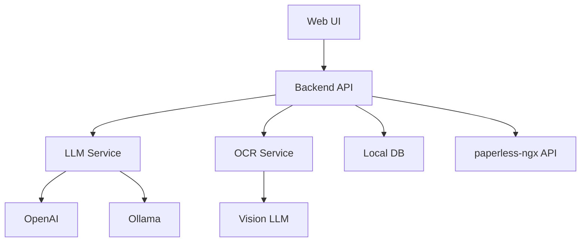
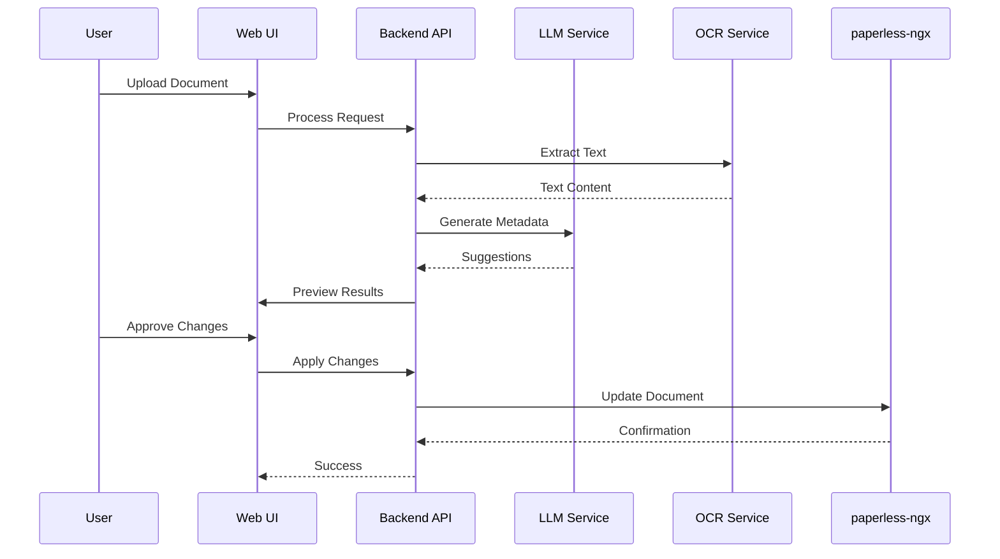

# paperless-gpt Architecture

This document provides a comprehensive overview of the paperless-gpt architecture, explaining how different components interact to provide AI-powered document processing capabilities.

## System Overview

paperless-gpt is designed as a companion service to paperless-ngx, adding AI capabilities for document processing. The system consists of several key components:



## Core Components

### 1. Backend API (Go)
- Handles all business logic
- Manages document processing workflow
- Coordinates between services
- Provides REST API endpoints
- Manages state and caching

### 2. Web UI (React + TypeScript)
- User interface for document management
- Real-time processing status
- Document preview and editing
- Configuration interface
- Responsive design

### 3. LLM Service
- Manages LLM provider connections
- Handles prompt engineering
- Processes document content
- Generates metadata suggestions
- Supports multiple providers:
  - OpenAI (gpt-4, gpt-3.5-turbo)
  - Ollama (llama2, etc.)

### 4. OCR Service
- Vision LLM integration
- Image preprocessing
- Text extraction
- Layout analysis
- Quality enhancement

### 5. Local Database
- Caches processing results
- Stores configuration
- Manages queues
- Tracks document state

## Data Flow

### Document Processing Flow


## Key Design Decisions

### 1. Modular Architecture
- Separation of concerns
- Pluggable components
- Easy to extend
- Maintainable code

### 2. Stateless Design
- Scalable architecture
- No shared state
- Resilient operation
- Easy deployment

### 3. Security First
- API authentication
- Data encryption
- Input validation
- Error handling

### 4. Performance Optimization
- Local caching
- Batch processing
- Async operations
- Resource management

## Directory Structure

```
paperless-gpt/
├── main.go                 # Application entry point
├── app_llm.go             # LLM service implementation
├── app_http_handlers.go    # HTTP handlers
├── paperless.go           # paperless-ngx integration
├── ocr.go                 # OCR service
├── types.go               # Type definitions
├── web-app/               # Frontend application
│   ├── src/
│   │   ├── components/    # React components
│   │   ├── App.tsx       # Main application
│   │   └── ...
│   └── ...
└── ...
```

## Configuration Management

The system uses environment variables for configuration, allowing easy deployment and configuration changes:

```
PAPERLESS_BASE_URL        # paperless-ngx connection
LLM_PROVIDER             # AI backend selection
VISION_LLM_PROVIDER      # OCR provider selection
...
```

## Error Handling

The system implements comprehensive error handling:

1. **User Errors**
   - Input validation
   - Clear error messages
   - Guided resolution

2. **System Errors**
   - Graceful degradation
   - Automatic retry
   - Error logging
   - Monitoring alerts

3. **External Service Errors**
   - Fallback options
   - Circuit breaking
   - Rate limiting
   - Error reporting

## Scaling Considerations

The architecture supports scaling through:

1. **Horizontal Scaling**
   - Stateless design
   - Load balancing
   - Distributed processing

2. **Resource Management**
   - Connection pooling
   - Cache management
   - Queue processing
   - Rate limiting

3. **Performance Optimization**
   - Batch processing
   - Async operations
   - Efficient algorithms
   - Resource caching

## Future Considerations

The architecture is designed to support future enhancements:

1. **Plugin System**
   - Custom processors
   - Integration points
   - Event hooks

2. **Advanced Features**
   - Multi-language support
   - Custom ML models
   - Advanced analytics

3. **Integration Options**
   - API extensions
   - Service hooks
   - Custom providers

## Development Guidelines

When making changes to the architecture:

1. **Documentation**
   - Update this document
   - Add inline comments
   - Update API docs

2. **Testing**
   - Unit tests
   - Integration tests
   - Performance tests

3. **Review Process**
   - Architecture review
   - Security review
   - Performance review

This architecture documentation is maintained by the core team and updated as the system evolves.
